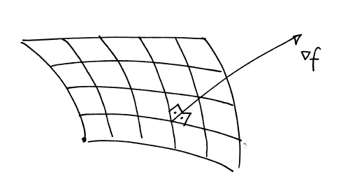
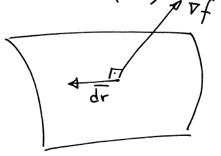

# 梯度, 散度, 旋度

## 偏微分与泰勒级数 (Partial Differentiation and Taylor series)

Scalar quantity $f$, which is a function of three variables, so $f=f(x, y, z)$.
The partial derivative of $f$ with respect to $x$ is defined to be the derivative of $f$ with respect to $x$, regarding $y$ and $z$ as constants. 
To indicate that $f$ is a function of move than ore variable, the partial derivative is written using a curly $d, \partial$. 
More formally, the definition of the partial derivative is

标量 $f$，是三个变量的函数，所以 $f=f(x,y,z)$. 
$f$关于$x$的偏导数定义为$f$关于$x$的导数, 而将$y$和$z$当作常数处理. 
为了表示 $f$ 是一个不只涉及一个变量的函数, 偏导数的写法使用了弯曲的 $d, \partial$. 更正式地说, 偏导数的定义是: 

$$
\frac{\partial f}{\partial x}=\lim _{\delta x \rightarrow 0} \frac{f(x+\delta x, y, z)-f(x, y, z)}{\delta x}
$$

Second derivatives, such as $\partial^2 f / \partial x^2$ and mixed derivatives, such as $\partial^2 f / \partial y \partial x$ can also be defined: 
the mixed derivative means that $f$ is differentiated with respect to $x$ regarding $y$ as a constant, and then differentiated with respect to $y$ regarding $x$ as a constant. 
An important property of this mixed derivative, or cross-derivative, is that the order of the two derivatives does not matter, i.e. 

二阶导数, 例如 $\partial^2 f / \partial x^2$ 和混合导数, 例如 $\partial^2 f / \partial y \partial x$ 可以被表达为: 
混合导数的含义是: 以 y$ 为常数, 对 $f$ 进行关于 $x$ 的微分, 然后以 x$ 为常数, 对 y$ 进行关于 $x$ 的微分. 
这种混合导数或交叉导数的一个重要性质是, 两个导数的顺序并不重要, 即, 

$$
\frac{\partial^2 f}{\partial y \partial x}=\frac{\partial^2 f}{\partial x \partial y}
$$

Provided that these second partial derivatives exist and are continuous.
$\Rightarrow$ One application: When a function is at a maximum or a minimum, all of its partial derivatives are zero. 

如果这些二次偏导数存在并且连续. 
$\Rightarrow$ 一个应用: 当一个函数处于最大值或最小值时, 它的所有偏导数都为零. 

## 泰勒级数 (Taylor series in more than variable)
The Taylor series for an infinitely differentiable function $f(x)$ of a single variable is

单变量无穷微分函数 $f(x)$ 的泰勒级数为

$$
\begin{aligned}
f(x) & =f(a)+(x-a) \frac{d f}{d x}(a)+\frac{(x-a)^2}{2 !} \frac{d^2 f}{d x^2}(a) \\
& +\cdots \\
& =\sum_{n=0}^{\infty} \frac{(x-a)^n}{n !} \frac{d^n f}{d x^n}(a)
\end{aligned}
$$

This can also be written as

$$
\delta f=\delta x \frac{d f}{d x}+\frac{(\delta x)^2}{2 !} \frac{d^2 f}{d x^2}+\cdots \cdot
$$

where $\delta x=(x-a)$ is a small perturbation and
$\delta f=f(x)-f(a)$ is the corresponding perturbation in the value of the function.

其中 $\delta x=(x-a)$ 是一个小扰动，而 $f=f(x)-f(a)$ 是函数值的相应扰动。

Taylor series can also be constructed for functions of more than one variable. 
For a function $f(x, y)$ of two independent variables, the analogous formula is

泰勒级数也可用于多个变量的函数。
对于两个独立变量的函数 $f(x,y)$，类似的公式为

$$
\begin{aligned}
\delta f= & \delta x \frac{\partial f}{\partial x}+\delta y \frac{\partial f}{\partial y}+\frac{(\delta x)^2}{2 !} \frac{\partial^2 f}{2 x^2}+ \\
& \frac{(\delta y)^2}{2 !} \frac{\partial^2 f}{\partial y^2}+\delta x \delta y \frac{\partial^2 f}{\partial x \partial y}+\cdots
\end{aligned}
$$

In most of our applications of the Taylor series, we will only use the linear terms.

$$
\delta f \cong \delta x \frac{\partial f}{\partial x}+\delta y \frac{\partial f}{\partial y}+\delta z \frac{\partial f}{\partial z}
$$

## 标量场的梯度 (Gradient of a scalar field)

A scalar field $f$ can be visualised in terms of the level surfaces or isosurfaces on which $f$ is constant. 
The gradient of the scalar field $f$ is a vector field, with a direction that is perpendicular to the level surfaces, pointing in the direction of increasing $f$, 
with a magnitude equal to the rate of change of $f$ in this direction. 

标量场 $f$ 可以用水平面或等值面来表示, 在水平面或等值面上 $f$ 是常数. 标量场 $f$ 的梯度是一个矢量场, 其方向与水平面垂直, 指向 $f$ 增加的方向, 
其大小等于 $f$ 在该方向上的变化率. 

The gradient of a scalar field $f$ can be written as grad $f$, but the gradient is so important that a special symbol grad, $\nabla$, is used, so grad $f=\nabla f$. This symbol is sometimes referred to as "del" or "nabla".
The gradient of $f$ can also be defined in a cartesian coordinate system in terms of the partial derivatives of $f$ :

标量场 $f$ 的梯度可以写成 grad $f$, 但梯度非常重要, 因此使用了一个特殊符号 grad, 即 $\nabla$, 所以 grad $f=\nabla f$. 这个符号有时被称为 "del "或 "nabla". 
在直角坐标系中, $f$的梯度也可以用$f$的偏导数来定义: 

$$
\nabla f=\frac{\partial f}{\partial x} \hat{e}_1+\frac{\partial f}{\partial y} \hat{e}_2+\frac{\partial f}{\partial z} \hat{e}_3 \quad (1)
$$

Show that these two definitions are equivalent, by showing that the vector $\nabla f$ defined in (1) satisfies the two conditions of being perpendicular to the level surfaces and with magnitude equal to the rate of change of $f$ in this direction.

通过证明(1)中定义的矢量 $\nabla f$ 满足垂直于水平面和大小等于 $f$ 在此方向上的变化率这两个条件, 证明这两个定义是等价的. 

Consider an infinitesimal change in position in space from $\bar{r}$ to $\bar{r}+d\bar{r}$. This results in a small change in the value of the scalar field $f$ from $f+d f$, where from the linear term expansion in Taylor series

考虑空间位置从 $\bar{r}$ 到 $\bar{r}+d\bar{r}$ 的微小变化。这将导致标量场 $f$ 的值从 $f+d f$ 发生微小变化，从泰勒级数的线性项展开可知

$$
\delta f=\frac{\partial f}{\partial x} \delta x+\frac{\partial f}{\partial y} y+\frac{\partial f}{\partial z} \delta z
$$

$$
\begin{aligned}
&\begin{aligned}
& \delta x=d x \\
& \delta y=d y \\
& \delta z=d z \\
& \delta f=d f
\end{aligned} \mid d f=\frac{\partial f}{\partial x} d x+\frac{\partial f}{\partial y} d y+\frac{\partial f}{\partial z} d z\\
&\begin{aligned}
d f & =\left(\frac{\partial f}{\partial x}, \frac{\partial f}{\partial y}, \frac{\partial f}{\partial z}\right) \cdot(d x, d y, d z) \\
& =\nabla f \cdot d \overline{r} \quad \text { (2) }
\end{aligned}
\end{aligned}
$$

Now suppose that $d \overline{r}$ lies in the surface $f=$ constant. In this case, the change in the value of $f$ must be zero, 
so we have $d f=\nabla f \cdot d\overline{r}=0 \quad(\bar{r}$ and $\bar{r}+d \overline{r}$ are on the same isosurface). 

现在假设 $d \overline{r}$ 位于曲面 $f=$ 常数. 在这种情况下，$f$ 值的变化必须为零, 
所以我们有 $d f=\nabla f \cdot d\overline{r}=0 (\bar{r}$ 和 $\bar{r}+d \overline{r}$ 在同一个等值面上). 

Now in general $\nabla f \neq 0$ and $d \overline{r} \neq 0$, so the two vectors $\nabla f$ and d $\overline{r}$ must be perpendicular.
Since d $\overline{r}$ is in the level surface $f=$ constant, the vector $\nabla f$ must be perpendicular to the level surface.

一般来说，$\nabla f \neq 0$ 和 $d \overline{r}$ 必须垂直. 所以两个向量 $\nabla f$ 和 $d \overline{r}$ 一定是相互垂直的. 
由于 $d \overline{r}$ 在水平面上 $f=$ 常数, 所以向量 $\nabla f$ 一定垂直于水平面. 

This means that the vector $\nabla f$ defined by (1) has the correct direction; it remains to be shown that it has the correct magnitude. 
This is achieved by using (2) with $d \overline{r}=\hat{n} d s$, where $\hat{n}$ is the unit normal to the level surface and $s$ is a distance measured along the normal.

这意味着由 (1) 定义的矢量 $\nabla f$ 的方向是正确的, 但还需要证明它的大小是正确的. 
这可以通过在 (2) 中使用 $d \overline{r}=\hat{n} d s$ 来实现, 其中 $\hat{n}$ 是水平面的单位法向量, $s$ 是沿法线测量的距离. 

In this case, $d f=\nabla f \cdot \hat{n} d s=|\nabla f| d s$, since $\nabla f$ and $\hat{n}$ are parallel and $|\hat{n}|=1$. 
Hence the magnitude of $\nabla f$ is

在这种情况下, $d f=\nabla f \cdot \hat{n} d s=|\nabla f| d s$, 
因为 $\nabla f$ 和 $\hat{n}$ 是平行的, 并且 $|\hat{n}|=1$, 
因此, $\nabla f$ 的大小为

$$
|\nabla f|=\frac{d f}{d s}
$$

which is the rate of change of $f$ with position along the normal. (s in this case)
From (2) it follow that $\nabla f$ can be used to find the rate of change of $f$ in any direction.
To find the rate of change of $f$ in the direction of the unit vector $\hat{u}$, set $d \overline{r}=\hat{u} d s$ where $d s$ is the distance along $\hat{u}$. 
Then $d f=\nabla f \cdot \hat{u} d s$ and so

式中 $\nabla f$ 为沿法线位置的变化率. (本例中为 s)
由 (2) 可知, $\nabla f$ 可用来求得 $f$ 沿任意方向的变化率. 
要计算 $f$ 在单位向量 $\hat{u}$ 方向上的变化率, 设置 $d \overline{r}=\hat{u} d s$, 
其中 $d s$ 是沿 $\hat{u}$ 的距离. 
那么 $d f=\nabla f \cdot \hat{u} d s$, 因此

$$
\frac{d f}{d s}=\nabla f \cdot \hat{u}
$$

This is the rate of change of $f$ in the direction of the unit vector $\hat{u}$, 
and is called the directional derivative of $f$. This can also be written as

$$
\frac{d f}{d s}=|\nabla f| \cos \theta
$$

where $\theta$ is the angle between $\nabla f$ and the unit vector $\hat{u}$. Since $-1 \leqslant \cos \theta \leqslant 1$, 
it follows that the magnitude of $\nabla f$ is equal to the maximum rate of change of $f$ with position

其中 $\theta$ 是 $\nabla f$ 与单位向量 $\hat{u}$ 之间的夹角. 由于 $-1 \leqslant \cos \theta \leqslant 1$, 
因此, $\nabla f$ 的大小等于 $f$ 随位置变化的最大速率

The symbol $\nabla$ can be interpreted as a vector differential operator,

$$
\nabla=\left(\frac{\partial}{\partial x}, \frac{\partial}{\partial y}, \frac{\partial}{\partial z}\right)
$$

where the term operator means that $\nabla$ only has a meaning when it acts on some other quantity.

$\Rightarrow$ applications of gradient: finding normals to surfaces, obtaining the rates of change of functions

## 梯度, 保守场和势能 (Gradients, conservative fields and potentials)
There is a very important link between the gradient of a scalar field and the concept of a conservative vector field. 
Recall that a conservative vector field is one in which the line integral along a curve connecting two points does not depend on the path taken. 
The connection between gradients and conservative fields is explained with following: 

标量场的梯度与保守向量场的概念之间有着非常重要的联系。
回顾一下，保守矢量场是指沿着连接两点的曲线的线积分不依赖于所走路径的矢量场。
梯度和保守向量场之间的联系可以用下面的内容来解释：

Suppose that a vector field $\bar{F}$ is related to a scalar field $\phi$ by $\bar{F}=\nabla \phi$ and $\nabla \phi$ exists everywhere in some region $D$. Then, $\bar{F}$ is conservative within $D$. Conversely, it $\bar{F}$ is conservative, then $\bar{F}$ can be written as the gradient of a scalar field, $\bar{F}=\nabla \phi$

假设一个向量场 $\bar{F}$ 与一个标量场 $\phi$ 的关系是 $\bar{F}=\nabla \phi$，并且 $\nabla \phi$在某个区域 $D$ 中无处不在。那么，$\bar{F}$在$D$内是保守的。
反过来，如果 $\bar{F}$ 是保守的，那么 $\bar{F}$ 可以写成一个标量场的梯度，即 $\bar{F}=\nabla \phi$

Proof

Suppose that $\bar{F}=\nabla \phi$. Then the line integral of $\bar{F}$ along a curve $C$ connecting two points $A$ and $B$ is

$$
\begin{aligned}
& \int_C \bar{F} \cdot d \overline{r}=\int_C \nabla \phi \cdot d \overline{r} \quad \underbrace{\nabla \phi \cdot d \overline{r}=d \phi}_{\text {from (2) }} \\
& \int_C \bar{F} \cdot d \overline{r}=\int_c d \phi=[\phi]_A^B=\phi(B)-\phi(A)
\end{aligned}
$$

where the line integral has been evaluated simply using $\phi$ as the parameter. 
Since this result only depends on the end points of $C, \bar{F}$ is conservative.

其中的线积分是用 $\phi$ 作为参数来计算的。
由于这一结果只取决于 $C 的端点，所以 \bar{F}$ 是保守的。

If a vector $\bar{F}$ is conservative, the corresponding scalar field $\phi$ which obeys $\bar{F}=\nabla \phi$ is called the potential for $\bar{F}$. Note that the potential is not unique, since an arbitrary constant can be added to $\phi$ without affecting $\nabla \phi$.

This arbitrary constant corresponds to the arbitrary choice of the origin for the lower limit in the integral in the definition

$$
\phi(\bar{r})=\int_0^{\bar{r}} \bar{F} \cdot d \overline{r}
$$

Example: 

Show that the vector field $\bar{F}=(2 x+y, x, 2 z)$ is conservative.
$\bar{F}$ can be written as the gradient of a scalar field $\phi$. This gives the three equations

$$
\begin{array}{lll}
\frac{\partial \phi}{\partial x}=2 x+y, & \frac{\partial \phi}{\partial y}=x, & \frac{\partial \phi}{\partial z}=2 z \\
\vdots & \vdots & \vdots \\
\text { integrate } & \text { find } h(y, z) & \text { find } h(y, z)
\end{array}
$$

$$
\begin{aligned}
& \int \frac{\partial \phi}{\partial x} d x=x^2+x y+h(y, z) \\
& \frac{\partial \phi}{\partial y}=x \quad \Rightarrow \frac{\partial h(y, z)}{\partial y}=0 \quad \begin{array}{r}
h(y, z) \text { depends } \\
\text { on only } z !
\end{array} \\
& \frac{\partial \phi}{\partial z}=2 z \quad \Rightarrow \frac{2 h(y, z)}{\partial z}=\frac{d h(z)}{d z}=2 z \\
& h(z)=z^2+c
\end{aligned}
$$

Therefore $\phi=x^2+x y+z^2$

Then $\bar{F}$ is conservative since it can be written as $\bar{F}=\nabla \phi$ with $\phi$ given above.

## 矢量场的散度 (Divergence of a vector field)
The divergence of a vector field $\bar{u}$ is a scalar field. Its value at a point $P$ is defined by

$$
\operatorname{div} \bar{u}=\lim _{\delta v \rightarrow 0} \frac{1}{\delta v} \int\kern{-8pt}\int\limits_{\delta \mathbf{s}} \kern{-24mu} \bigcirc \overline{\mathbf{u}} \cdot \hat{\mathbf{n}} \mathbf{d} \mathbf{s}
$$

where $\delta V$ is a small volume enclosing $P$ with surface $\delta S$ and $\hat{n}$ is the outward pointing normal to $\delta s$. 
Physically, this corresponds to the amount of flux of the vector field $\bar{u}$ out of $\delta V$ divided by the volume $\delta V$
