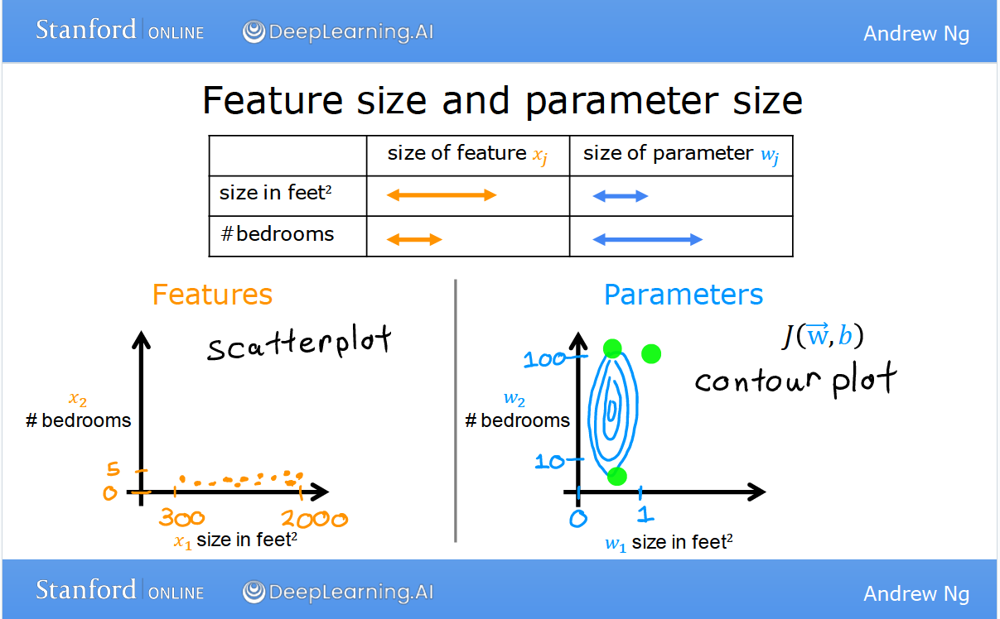
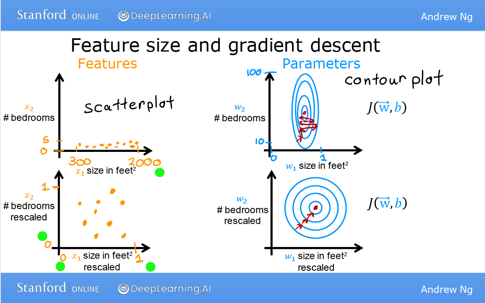
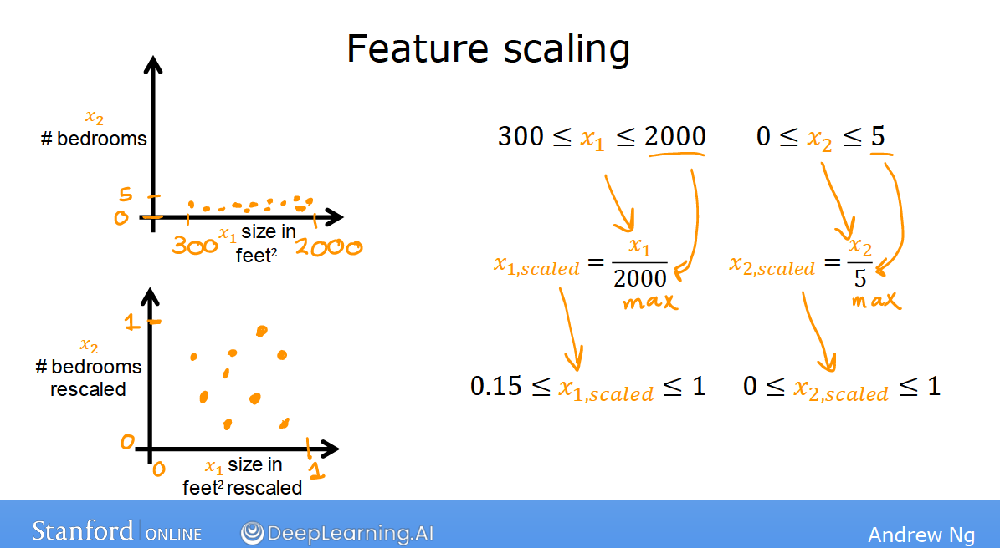
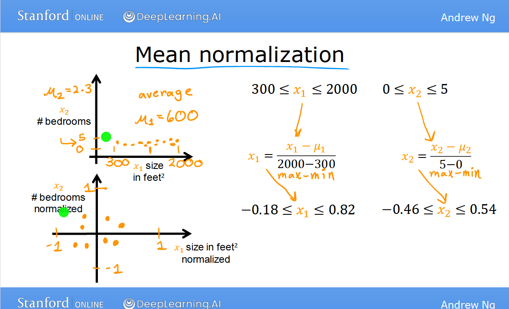
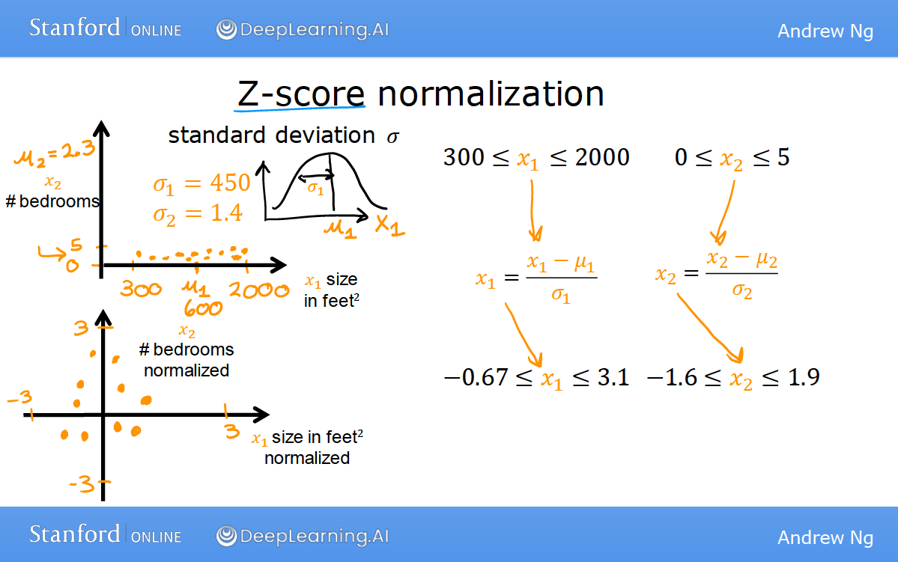

# 特征缩放 (Feature scaling)

前导知识：

* [梯度下降算法](gradient_descent.md)

特征缩放是一种用来对相互独立的变量 (特征值) 的范围进行归一化的方法。
有时它也被称作数据归一化，通常用在数据预处理的过程中。现实生活中的数
据集中通常在数值，范围和单位上都有较大的区别; 如果不进行预处理，可能
会出现下图中的情况: 

注意到变量w_1的范围比较狭窄，这会使得梯度下降算法难以找到最快下降的路径。
如果我们对特征值进行缩放, 如下图所示: 

此时即可较顺利的找到最速下降路径。

常见的缩放方法有：
1. 最小/最大值缩放; 

2. 平均值归一化;

3. Z-score 归一化; 

4. 对数变换
