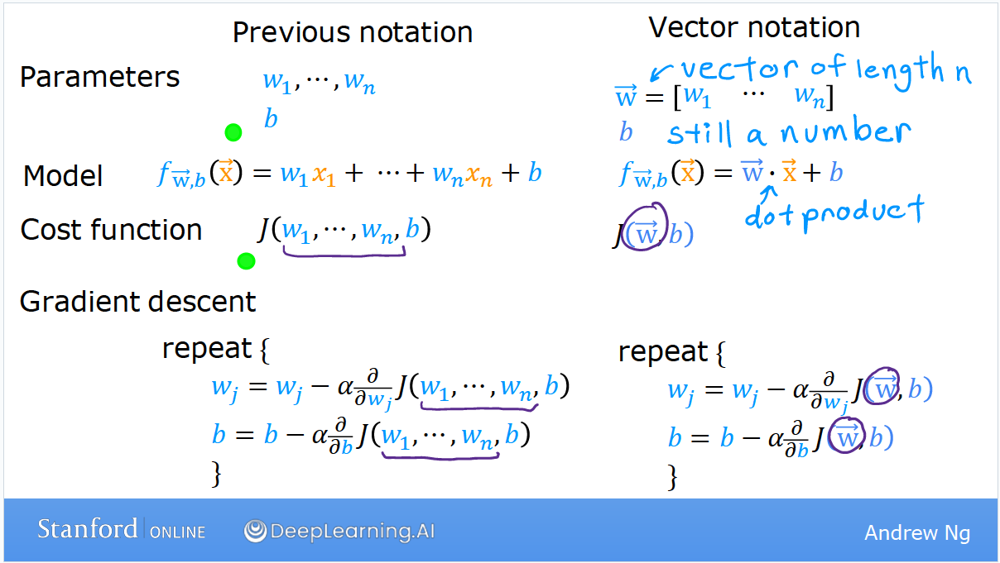
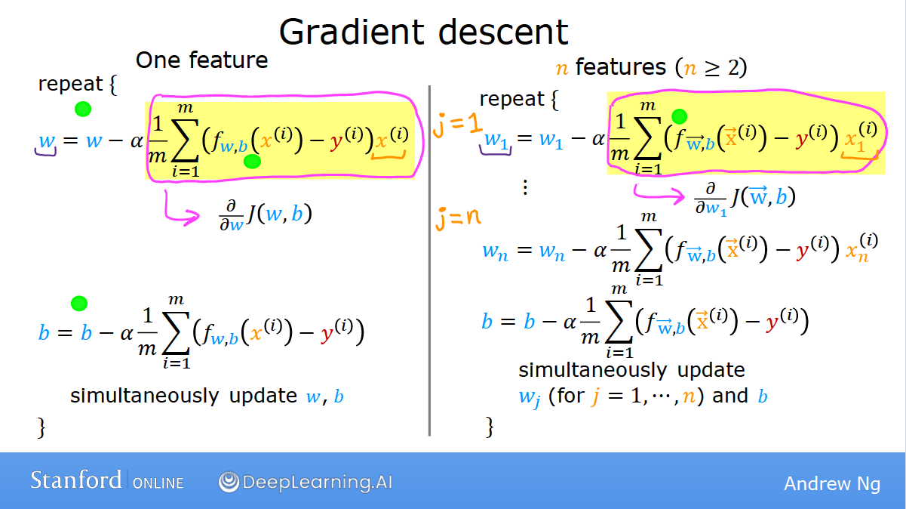

# 梯度下降算法 （Gradient descent）

## 1. 基本概念
假设我们要解决下面的问题：

我们有一个函数（实际上就是成本函数）
J($w_1$, $w_2$, ..., $w_n$, b),
我们需要得到这个函数的最小值。

梯度下降算法的思路是：
1. 给出一个初始的猜测值（比如w=0, b=0）
2. 不断改变w和b的值来减小J(w, b)的值，直到获得极小值

需要指出的是最小值可能不止一个。

这个过程类似于我们站在山顶，环顾四周，选择能让我们最快下山的一个方向，迈出一步；
之后再重新环顾四周，选择能让我们最快下山的一个方向，再迈出一步...依次类推，直到抵达山谷：

初始值的选择对于梯度下降算法非常重要。
选择了差异很小的初始值可能导致最终结果有较大的差异。所有的这些结果都是局部极小值 (local minima)。

上述例子中体现的梯度下降算法的数学表达是：

式中 $\alpha$ 代表学习效率。
这里需要注意两点：
1. 计算机语言中等号"="的含义和数学中的不同，表示将等号右边的值赋值等号左边的变量。等于则是用"=="表示。
2. 每次在迭代（即上面例子中下山时的每一步）的时候，w, b需要同步更新；也就是说不能用**更新后**的w来计算**更新后**b的值。

## 多元线性回归的梯度下降算法
前导知识：

* [多变量](multiple_features.md)

* [线性回归](linear_regression.md)

* [矢量化](vectorization.md)

借助矢量化，我们可以将变量/模型/成本函数/梯度下降算法表示为下图：

注意到对于多元变量/多特征值，我们在求解每一个特征值($w_1$~$w_n$) 的梯度的时候，
我们使用的是偏微分（即对成本函数中的每一个变量分别求导；
对$w_1$求导时，$w_2$应视为常数，依次类推），如下图：

一种代替梯度下降算法的方法：正则方程 (Normal Equation):

* 只对线性回归有效，没有迭代 (iterations) 过程

* 对于其他机器学习算法无效；特征值大于10000时计算缓慢

