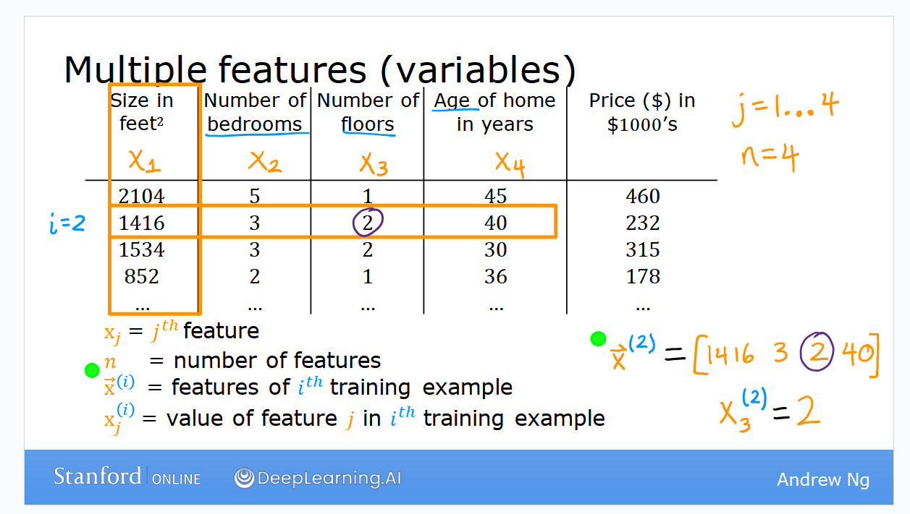
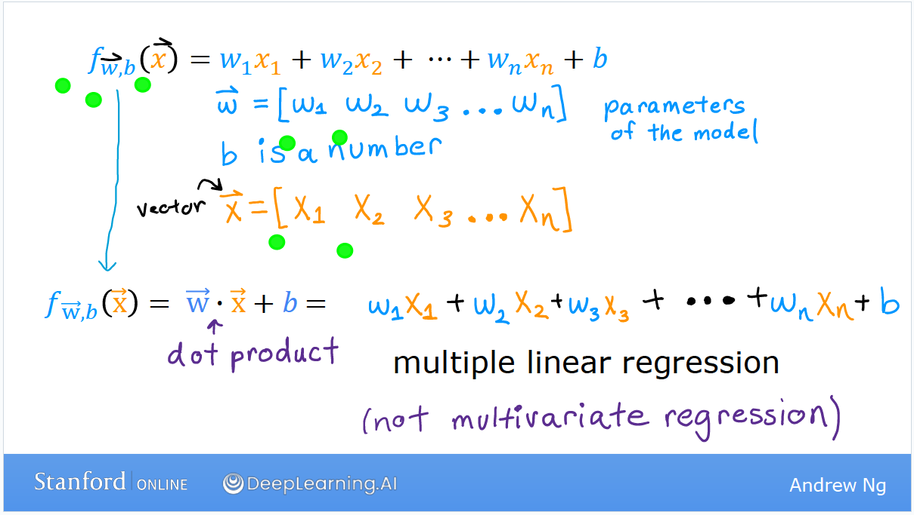

# 多变量
之前的讨论中我们用到了房价的例子。
当时我们只引入了房屋面积 ($x_1$) 这一个变量，
如果我们多引入一些其他变量的话，那么整个统计表将会变成这样：

在这里我们定义了房屋面积，卧室数量，房屋年龄，房价 ($x_1 - x_4$) 四个变量。
第i行表示第i个训练样本，我们用上标x ($x^i$) 表示。训练样本是向量。
此时回归函数可以写为下图中向量数量积的形式：

注意，多变量回归 (multiple variables regression) 与多元回归 (multivariate regression) 是不一样的。
