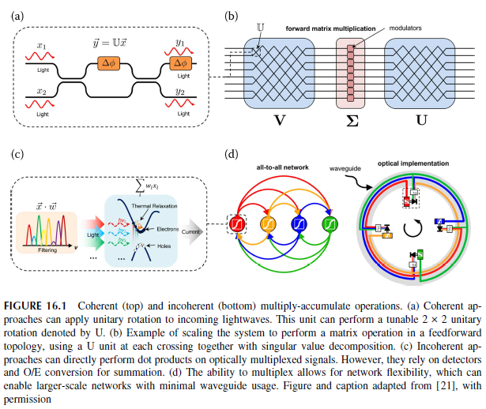

# 神经网络

以下是Shastri教授的关于Neuromorphic Silicon (硅光神经网络)的[课本](2021 book Neuromorphic Silicon.pdf)中提到的专业名词的解释：

## 人工神经网络 (ANN)

参见：[人工神经网络](../../machine_learning/ann.md)

人工神经网络（ANN）是一种计算模型，其灵感来源于人脑中生物神经网络的结构和功能。人工神经网络用于机器学习和深度学习，通过从数据中学习来执行模式识别、分类、回归等任务。

人工神经网络由相互连接的节点或 "神经元 "组成，这些节点或 "神经元 "被分成若干层。每一层在处理和转换数据时都有特定的作用。人工神经网络中最常见的层类型包括:

输入层： 这一层接收初始输入数据，并将其传递给下一层。输入层中的每个神经元都对应输入数据的一个特征或属性。

隐藏层： 它们是输入层和输出层之间的中间层。它们通过一系列计算来处理和转换输入数据。隐藏层允许网络学习数据中的复杂模式和关系。

输出层： 这一层产生神经网络的最终输出。输出层中神经元的数量取决于网络设计的具体任务。例如，在二元分类任务中，可能有两个输出神经元代表两个可能的类别。

相邻层神经元之间的每个连接都有一个相关权重，它决定了连接的强度。在训练过程中，这些权重会根据网络在训练数据集上的表现进行调整。目标是最大限度地减少网络预测输出与训练数据中实际目标值之间的差异。

人工神经网络的训练过程包括：

前向传播： 输入数据通过网络，逐层进行计算，产生输出。这就是前向传播过程。

损失计算： 使用损失函数（也称为成本函数）测量预测输出与实际目标值之间的差异。目标是最大限度地减少损失。

反向传播： 通过损失函数计算出的误差会在网络中向后传播。这包括计算损失相对于神经元权重和偏置的梯度。这些梯度表示每个权重应调整多少才能减少损失。

梯度下降： 利用梯度下降等优化技术，按照减少损失的方向更新权重和偏置。这种调整权重和偏置的迭代过程一直持续到网络的性能收敛到可接受的水平。

通过这种训练过程，人工神经网络学会识别数据中的模式、特征和关系，从而能够对未见过的新数据进行准确预测或分类。人工神经网络已在图像识别、自然语言处理、语音识别、自动驾驶等广泛的应用中展现出非凡的能力。

## Neuromorphic Silicon Photonics

### Introduction

Neural networks have enjoyed renewed popularity over the last decade under the appellation of "deep learning" $[1,2]$. 
The idea of mimicking the brain to process information, however, 
can be traced back half a century prior to Rosenblatt's perceptron [3], 
and the first experimental models of biological neurons to Hodgkin and Huxley a few years prior [4]. 
The artificial neurons that make up neural networks take many forms, some more closely related to this biological inspiration. 
Yet all neural networks take the form of simple nodes that (a) perform a linear operation on multiple other neurons' outputs, 
(b) integrate the resulting signals, and (c) perform a nonlinear transformation on the summed, weighted inputs. 
Various interconnection topologies-feedforward, feedback (recurrent), close-neighbor translationally-invariant (convolutional), etc.
-endow the network with different computational properties.

过去十年来，神经网络以 "深度学习"$[1,2]$ 的称谓再次受到人们的青睐。然而，模仿大脑处理信息的想法可以追溯到半个世纪前罗森布拉特的感知器[3]，
而第一个生物神经元实验模型则是几年前霍奇金和赫胥黎提出的[4]。构成神经网络的人工神经元有多种形式，其中一些与生物灵感的关系更为密切。
然而，所有神经网络都采用简单节点的形式，这些节点(a) 对多个其他神经元的输出进行线性运算，(b) 对产生的信号进行整合，(c) 对加权后的总和输入进行非线性变换。
各种互连拓扑结构--前馈、反馈（递归）、近邻平移不变（卷积）等--赋予网络不同的计算特性。

Such an asynchronous, parallel framework is at odds with the digital von Neumann architecture that electronic microprocessors often employ for their emulation. 
This mismatch was recognized early on, leading to pioneering work by VLSI engineers starting in the 1980's to map the physics of transistors to neuronal models for gains in computational density, 
energy efficiency, and speed [5]. However, Moore's Law and Dennard scaling kept such "neuromorphic" architecture outside of the limelight in favor of general-purpose digital processors. 
Today, this scaling nears its end, and researchers turn to ever more specialized hardware such as graphical processing units [6], tensor processing units [7], 
and specially-configured field-programmable gate arrays [8] to run demanding neural network models. 
This is renewing interest in neuromorphic application-specific integrated circuits (ASICs), 
the extrapolated conclusion of this trend.

这种异步并行框架与电子微处理器通常采用的冯-诺依曼数字架构相悖。
人们很早就认识到了这种不匹配，因此从 20 世纪 80 年代开始，超大规模集成电路（VLSI）工程师们就致力于将晶体管物理映射到神经元模型，
以提高计算密度、能效和速度[5]。然而，摩尔定律和 Dennard Scaling 使这种 "神经形态 "架构远离了人们的视线，转而青睐通用数字处理器。
如今，这种扩展已接近尾声，研究人员转而使用图形处理单元[6]、张量处理单元[7]和特殊配置的现场可编程门阵列[8]等更加专业化的硬件来运行要求苛刻的神经网络模型。
这再次激发了人们对神经形态应用专用集成电路（ASIC）的兴趣，这也是这一趋势的必然结果。

Since the requirements of neuromorphic hardware differ from von Neumann digital computing, 
it is not obvious that silicon microelectronics must provide the best substrate for neuromorphic ASICs $[9,10]$. 
The reliance of neural networks on simple networked nodes suggests that a platform suited for communications, 
such as photonics, might have an advantage. 
This was recognized in the 80's [11], yet the lack of integrability limited investigations at the time. 
The commercial silicon photonic platforms that have arisen over the last few years, however, now offer high index contrast, 
low-loss waveguides integrated with high bandwidth optoelectronics for signal modulation and detection [12]. 
Furthermore, the reuse of materials and processes from microelectronics allows the platform to enjoy its economies of scale. 
This, combined with the intrinsic appeal of photonics to emulate neural models, 
is one of the reasons that the newly termed field of neuromorphic photonics has attracted considerable attention [10,13-17].

由于神经形态硬件的要求不同于冯-诺依曼数字计算，因此硅微电子技术必须为神经形态专用集成电路提供最佳基板并不明显$[9,10]$。
神经网络对简单网络节点的依赖表明，光子学等适合通信的平台可能具有优势。这一点早在上世纪 80 年代就已意识到[11]，但由于缺乏可集成性，当时的研究受到了限制。
然而，过去几年中出现的商用硅光子平台现在可提供高指数对比度、低损耗波导，并集成了用于信号调制和检测的高带宽光电子技术[12]。
此外，微电子材料和工艺的再利用使该平台能够享受规模经济效益。这一点，再加上光子学在模拟神经模型方面的内在吸引力，
是新近被称为神经形态光子学的领域引起广泛关注的原因之一[10,13-17]。

### Silicon Photonic Neurons

A major impetus of the resurgence of neuromorphic photonics in the 2010s was the recognition that the dynamics of some active photonic components are mathematically equivalent to leaky integrate-and-fire spiking neuron models [18]. 
Silicon's indirect bandgap precludes efficient light sources and amplifiers that would easily allow such a quantum-level spiking neuron model to be implemented. 
This can be overcome by, for example, depositing optically active films like phase-change materials [19] or by combining emission from emissive centers with single-photon detectors at cryogenic temperatures [20].

2010 年代，神经形态光子学再次兴起的主要推动力是人们认识到，某些有源光子元件的动态在数学上等同于泄漏积分-发射尖峰神经元模型[18]。
硅的间接带隙排除了高效光源和放大器，而这些光源和放大器可以轻松实现这种量子级尖峰神经元模型。
例如，可以通过沉积相变材料等光学活性薄膜[19]或在低温条件下将发射中心的发射与单光子探测器结合起来[20]来克服这一问题。

There are, however, alternate and easier to program neuron models that lend themselves almost perfectly to the room-temperature high-bandwidth optoelectronics of silicon photonic. 
Such continuous artificial neurons encode information in an analog property of the light instead of spike timing:

不过，还有其他更容易编程的神经元模型，它们几乎完全适用于硅光子室温高带宽光电子学。这种连续的人工神经元用光的模拟特性来编码信息，而不是用尖峰计时来编码信息：

$$
\mathrm{ds}(\mathrm{t}) / \mathrm{dt}=\mathrm{W} \cdot \mathrm{f}(\mathrm{s}(\mathrm{t}))-\mathrm{s}(\mathrm{t}) / \tau+\mathrm{w}_{\text {in }} \mathrm{u}(\mathrm{t}) .
$$

Here, a neuron's internal state $s$ drives others through a continuous (non-spiking) nonlinear transfer function. 
This model has two important components: (1) matrix-vector multiplication $\mathbf{W} \cdot \mathbf{x}$ (equivalently multiply-accumulate (MAC) operations) between a neuron's inputs $x$ and its weights $w$, 
the non-biological equivalent of a synapse, and (2) a nonlinear transformation of the input state to the broadcast output $f(s)$. $\tau$ captures the time constant of the nonlinear unit, 
and $u$ is the external drive. Stripped of temporal components, this reduces to the non-dynamical artificial neuron model ubiquitous in deep learning for the neuron's output $f(s)=f\left(\mathbf{W} \cdot f(\mathbf{s})+w_{\text {in }} u\right)$. 
This artificial neural network model, while simple, has been immensely successful in applications and is almost exclusively used. Implemented in silicon photonics, it offers a way to do complex neural computation with nanosecond latencies, opening up a wealth of new application domains.

在这里，神经元的内部状态 $s$ 通过连续（非尖峰）非线性传递函数驱动其他神经元。
该模型有两个重要组成部分： (1) 矩阵-向量乘法 $\mathbf{W}$ \(2) 从输入状态到广播输出 $f(s)$的非线性转换。
$\tau$是非线性单元的时间常数，$u$是外部驱动力。剔除时间成分，这就简化为深度学习中普遍存在的非动态人工神经元模型，
即神经元的输出 $f(s)=f\left(\mathbf{W} \cdot f(\mathbf{s})+w_{\text {in }} u\right)$ 。
这种人工神经网络模型虽然简单，但在应用中却取得了巨大成功，几乎被广泛使用。在硅光子学中实现，它提供了一种以纳秒级延迟进行复杂神经计算的方法，从而开辟了大量新的应用领域。

#### Multiply-Accumulate Operation

Two broad philosophies have been explored for multiply-accumulate operations in silicon photonics: coherent and incoherent. In the coherent framework pictured in Figure 16.1a-b, beamsplitters and phase shifters control the interference of light of a well-defined wavelength, mode, and polarization. When meshed appropriately, any unitary transformation can be performed on a pathencoded coherent input beam, directly implementing matrix-vector multiplication at the speed of light in the waveguide. This approach was originally considered for linear photonic quantum information processing, and was demonstrated with a mesh of Mach-Zehnder modulators [22]. Since the coherent approach is isomorphic to a vector-matrix multiplication, summing occurs naturally.

对于硅光子学中的多重累加操作，人们已经探索出两种广泛的理念：相干和非相干。在图 16.1a-b 所示的相干框架中，分光镜和移相器控制着明确波长、模式和偏振的光的干涉。如果网格划分得当，任何单元变换都可以在光路编码的相干输入光束上进行，在波导中以光速直接实现矩阵-矢量乘法。这种方法最初被用于线性光子量子信息处理，并通过马赫-泽恩德调制器网格进行了演示[22]。由于相干方法与矢量-矩阵乘法同构，因此自然会发生求和。

The incoherent approach, in contrast, is presented in Figure 16.1c-d. There, values are represented through the relative intensities of light in a collection of wavelengths, modes and/or polarization. Linear operations are performed through selective filtering and/or attenuation. In this approach, a single photodetection step implements summing by yielding a photocurrent proportional to the sum of the optical powers across the incoming modes. Termed "broadcast-andweight", this is explored in [23] and first demonstrated in silicon by controlling the transmission of microring resonators in [24]. Resonators can also only be used for filtering and followed by electro-absorption modulators to achieve the same effect [25].

图 16.1c-d 则是非相干方法。在这里，数值是通过一系列波长、模式和/或偏振中光的相对强度来表示的。通过选择性滤波和/或衰减进行线性运算。在这种方法中，单个光检测步骤通过产生与进入模式的光功率之和成正比的光电流来实现求和。文献[23]对此进行了探讨，文献[24]通过控制微波谐振器的传输，首次在硅材料中演示了这种方法。谐振器也可以只用于滤波，然后通过电吸收调制器达到同样的效果[25]。

To be able to adjust a neuron's weights, the beamsplitters, phase shifters, filters, and attenuators mentioned above must be tunable. This constitutes the main source of complexity in a photonic neural network, since e.g., a fully connected network of $N$ neurons will require $N^2$ weights to be controlled. Silicon exhibits a strong thermo-optic effect, and local metal or doped heaters are often used for "slow" index changes to implement this reconfigurability. Phase-change materials have also been considered for non-volatile control of transmission [26,27]. A technique worth mentioning and used for incoherent networks is resonator photoconductive control. First applied to silicon photonic neuron weights in [28], this technique leverages the measurable photo absorption induced change of a doped ring resonator's resistance to "lock" the filter transmission to the desired point. Using photoresistance as a proxy for optical power further has the advantage of not requiring access to the optical signal for calibration, enabling large-scale actuation [29]. Control of this transmission is what ultimately limits the effective fixed-point bit resolution that can be achieved for the multiply-accumulate operation, an important metric for comparison with digital alternatives. Currently, record 7.2 bits of accuracy and precision were demonstrated [29], close to characterized by a Lorentzian, proper restriction of the current swings allows emulation of popular deep learning activation functions such as rectified-linear (ReLu), sigmoid, and quadratic (not shown). Similar to the weighting case, electro-absorption modulators were also proposed for this purpose [37].

为了能够调整神经元的权重，上述分束器、移相器、滤波器和衰减器必须是可调的。这是光子神经网络复杂性的主要来源，因为例如，一个由 N$ 个神经元组成的全连接网络需要 N^2$ 个权重来控制。硅具有很强的热光学效应，通常使用局部金属或掺杂加热器来实现 "缓慢 "的指数变化，以实现这种可重构性。相变材料也被考虑用于传输的非易失性控制 [26,27]。值得一提的用于非相干网络的技术是谐振器光电导控制。这种技术首次应用于硅光子神经元权重[28]，利用可测量的光吸收引起的掺杂环形谐振器电阻变化，将滤波器传输 "锁定 "在所需的点上。使用光阻作为光功率的替代物还具有无需获取光信号进行校准的优势，从而实现了大规模驱动[29]。对这种传输的控制最终限制了乘积操作所能达到的有效定点比特分辨率，而这是与数字替代方案进行比较的重要指标。目前，7.2 位的精度和准确度已被证实[29]，接近洛伦兹特征，对电流波动的适当限制允许模拟流行的深度学习激活函数，如整流线性（ReLu）、sigmoid 和二次方（未显示）。与加权情况类似，电吸收调制器也是为此目的而提出的[37]。

An important property of the nonlinear unit is its cascadability. Physical cascadability requires that the output of a neuron be compatible with its input i.e., that the nodes described be networked. The incoherent units of Figure 16.2 do this by matching the resonator modulator's wavelengths to the resonant filters used for the MAC operations. Gain cascadability quantifies if the output of a neuron suffices to drive all of its fan-out. The specific amount of gain required within a single nonlinear unit ultimately depends on signal levels and network characteristics such as fan-in, fanout, and level of attenuation by the weights. Finally, for cascadability to be present from the point of view of noise, we require a signal-to-noise ratio $>1$ after the signal has propagated through the network. This means the neuronal nonlinearity must counteract the amplitude and phase noise due to e.g., imperfect control elements that are present in both coherent and incoherent approaches.

非线性单元的一个重要特性是其级联性。物理级联性要求神经元的输出与其输入相匹配，即所描述的节点必须联网。图 16.2 中的非相干单元通过将谐振调制器的波长与用于 MAC 运算的谐振滤波器相匹配来实现这一点。增益级联能力量化了神经元的输出是否足以驱动其所有扇出。单个非线性单元所需的具体增益量最终取决于信号水平和网络特性，如扇入、扇出和权重衰减水平。最后，从噪声的角度来看，要实现级联性，我们要求信号在网络中传播后的信噪比为 $>1$。这意味着神经元的非线性必须抵消相干和非相干方法中存在的不完美控制元件等引起的振幅和相位噪声。

A quantified measure of cascadability can be obtained through an autapse, or self-connection, experiment. Such experiments have been performed in both laser spiking [38] and silicon modulator neurons [36]. For the forward-biased pn-junction modulator neuron of Figure 16.2, for instance, a minimum optical pump power of $2 V_\pi / \pi R_{p d} R_b$ is required to have a gain larger than unity, and this is seen in experiments. The balance of signal degradation and noise trimming from the Lorentzian transmission in a pn-junction system with realistic component values was studied theoretically [39]. The results yielded over $50 \mathrm{~dB}$ of calculated signal-to-noise after an arbitrarily large network, hinting that such a system offers an amount of cascadability from the point of view of noise.

级联性的量化测量可通过自复发或自连接实验获得。此类实验已在激光尖峰[38]和硅调制器神经元[36]中进行过。例如，对于图 16.2 中的正向偏压 pn 结调制器神经元来说，最小光泵浦功率为 2 V_\pi / \pi R_{p d} R_b$ 时，神经元的自失效性才会发生。R_b$ 的增益需要大于 1，这在实验中可以看到。在一个具有实际元件值的 pn 结系统中，理论上研究了洛伦兹传输中信号衰减和噪声微调的平衡问题[39]。结果表明，在一个任意大的网络中，计算信噪比超过 50 \mathrm{~dB}$，这表明从噪声的角度来看，这种系统具有一定的可级联性。
