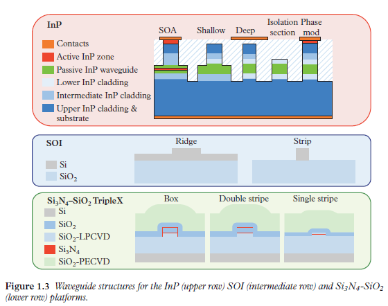

# Fabrication Technologies

PIP circuits rely principally on optical waveguides and therefore the same material platforms and approaches that are employed in the implementation of ASPICs are applicable here. 
In addition to the low cost implicit in the economies of scale resulting from replicating the same architecture, 
further cost savings can be made by aligning the fabrication processes with current state-of-the-art generic integration (GIM) and generic foundry (GFM) models [34]. 
In the GIM a small set of standardised BBBs are provided to control the basic properties of light, 
after which more complex circuits or compound building blocks (CBBs) are built by connecting several BBBs. 
In the GFM the foundry provides a shared open access to its generic integration process through multi-project wafers, 
where different designs or ASPICs from different users are combined on the same wafer; this allows cost sharing and other additional advantages, e.g. on-wafer testing. 
Since GIM and GFM allow a broad range of functionalities to be synthesised from a small set of BBBs they have been identified as the only path leading to mass production and subsequent cost reduction for PIC manufacturing, 
where figures in the order of $10 \kern{3mu} euros / \mathrm{mm}^2$ can already be reached at volumes of 1,000 chips for InP technology [34].

To date, three material platforms: indium phosphide (InP), 
silicon on insulator (SOI) and silicon nitride $\left(\mathrm{Si}_3 \mathrm{~N}_4-\mathrm{SiO}_2\right)$ have reached the required degree of maturity to be considered as viable options for the implementation of PIPs, 
either monolithic or hybrid. These operate mainly in the 1.3 and 1.55 $\mu \mathrm{m}$ wavelength regions. 
The next few sections briefly review the salient features of these and we refer the interested reader to the abundant literature in the field. 

PIP线路主要依赖于光波导，因此在ASPICs实施中所采用的相同材料平台和方法在这里也同样适用。除了复制相同架构所固有的规模经济带来的低成本外，通过将制造工艺与当前最先进的通用集成（GIM）和通用代工厂（GFM）模型对齐，还可以进一步节省成本。
在GIM中，提供一小套标准化的BBB来控制光的基本属性，之后通过连接几个BBB来构建更复杂的电路或复合构建模块（CBBs）。
在GFM中，代工厂通过多项目晶圆，向其通用集成过程提供共享开放的访问，不同用户的不同设计或ASPICs被组合在同一晶圆上；
这允许成本共享和其他额外的优势，例如晶圆上测试。由于GIM和GFM允许从一小套BBB合成广泛的功能，它们被确定为通往PIC大规模生产及后续成本降低的唯一途径，
在InP技术方面，已经能够在1000片芯片的体量下达到每平方毫米10欧元的成本。

迄今为止，有三种材料平台：磷化铟（InP），硅（SOI）和氮化硅 $\left(\mathrm{Si}_3 \mathrm{~N}_4-\mathrm{SiO}_2\right)$ 已经达到了被视为PIP实现的可行选择的成熟度，
无论是单片 (monolithic) 还是混合 (hybrid)。 这些主要在1.3和1.55 $\mu \mathrm{m}$ 波长区域运行。

## 1. Introduction to Practical Limitations
Ideally, a higher number of TBUs in a PIP processor results in a more versatile waveguide mesh circuit. 
However, in practice, there exist footprint limitations together with several sources of degradation that must be considered: accumulated losses, 
imperfect coupling splitting ratios, phase control, parasitic back-reflections, loss imbalances, fabrication errors (gradients through the circuit in thickness or temperature) 
and drift in time [19], [23]. These factors will be thoroughly addressed and discussed in Chapter 6, but here we provide a brief introduction.

在理想情况下，PIP处理器中的TBU数量越多，得到的波导网格电路就越多功能。然而，在实践中，存在着占地面积的限制以及必须考虑的几个降级来源：
累积损耗、不完美的耦合分配比率、相位控制、寄生背向反射、损耗不平衡、制造误差（通过电路的厚度或温度梯度）以及随时间的漂移[19]，[23]。
这些因素将在第6章中被彻底讨论和解决，但这里我们提供一个简短的介绍。

Several works reporting the integration of a high-density MZI arrangement for matrix-switching operations have succeeded at integrating more than 450 structures in a single die in an SOI platform, 
exceeding the limits set by Moore's law [50].

许多报告集成了高密度MZI排列用于矩阵切换操作的工作已经成功在单一SOI平台上集成了超过450个结构，超过了摩尔定律设定的限制[50]。

When designing programmable waveguide meshes, the designer faces an important miniaturisation trade-off: 
minimum delay and accumulated losses. The BUL and the group index will determine the minimum delay. 
For low refractive index difference platforms, the BUL is mainly limited by the tuning mechanism length and the $3-\mathrm{dB}$ coupler lengths. 
$3-\mathrm{dB}$ couplers in silicon can be reduced to less than $50 \mu \mathrm{m}$ [51], [52], including the bend sections, while the heaters can be reduced to $62 \mu \mathrm{m}$ [53]. 
With the inclusion of bends and straight waveguide sections to increase the distance between both arms of the TBU to decrease thermal crosstalk, 
a total BUL of $240 \mu \mathrm{m}$ seems potentially achievable. Assuming a typical SOI group index of 4.18, 
this is translated to maximum FSRs of around 150 and $50 \mathrm{GHz}$ for the synthesis of MZIs and ORRs, respectively, 
in the hexagonal waveguide mesh topology. However, a reduction of the BUL implies that the signal must go through a greater number of TBUs to obtain a desired delay. 
If the $3-\mathrm{dB}$ couplers limit the overall IL of the TBU, this miniaturisation trade-off must be highly considered. 
In fact, the main limitation of these structures resides in the number of accumulated losses. Assuming $0.1-\mathrm{dB}$ loss $3-\mathrm{dB}$ couplers, 
a path equivalent to 50 BULs will experience additional $10-\mathrm{dB}$ losses than a classic waveguide of the same length. 

在设计可编程波导网格时，设计师面临一个重要的小型化权衡：最小延迟和累积损耗。
基本单元长度（BUL）和群体折射率将决定最小延迟。对于低折射率差平台，BUL主要受到调谐机制长度和3-dB耦合器长度的限制。
硅中的3-dB耦合器可以减少到小于50微米[51]，[52]，包括弯曲部分，而加热器可以减少到62微米[53]。包括弯曲和直波导部分以增加TBU两臂之间的距离，以减少热串扰，
总的BUL达到240微米似乎是可能的。假设典型的SOI群体折射率为4.18，这将转化为六角波导网格拓扑结构中合成MZIs和ORRs的最大FSR分别约为150 GHz和50 GHz。
然而，BUL的减小意味着信号必须通过更多的TBU才能获得所需的延迟。如果3-dB耦合器限制了TBU的总IL，则必须高度考虑这种小型化权衡。
实际上，这些结构的主要限制在于累积损耗的数量。假设0.1-dB损耗的3-dB耦合器，相当于50 BULs的路径将比相同长度的经典波导额外经历10-dB的损失。

The tuning mechanism impact on the final TBU length, tuning crosstalk and power consumption will limit the maximum number of active TBUs at the operational mesh and its performance. 
The use of alternative tuning mechanisms micro-electromechanical systems (MEMS), piezoelectrics, or electromechanics are promising solutions to reduce the power consumption while enabling a reduction of the distance between the two TBU arms.

调谐机制对最终TBU长度、调谐串扰和功耗的影响将限制操作网格中的最大活动TBU数量及其性能。
使用替代调谐机制，如微机电系统（MEMS）、压电或电机械是减少功耗的有希望的解决方案，同时能够减小两TBU臂之间的距离。

Other sources of limitation are connected to fabrication and biasing errors in the TBUs implementing the PIP circuit. 
Even if these are tightly controlled unavoidable drifts in the circuit parameter setting will arise due to environmental factors. 
Thus, active monitoring and corrective schemes will be necessary in PIPs (see Chapter 6).

其他限制来源与在实施PIP电路的TBU中的制造和偏置误差有关。即使这些被严格控制，由于环境因素，电路参数设置中不可避免的漂移将会出现。
因此，在PIPs中将需要主动监控和纠正方案（见第6章）。
