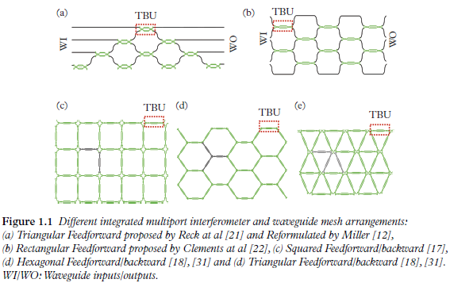

# Integrated Multi-port Interferometers and Waveguide Meshes 

## 1. Basic Concepts
Integrated multi-port interferometers and waveguide meshes are $2 \mathrm{D}$ structures where a unitary cell composed of a single tunable basic unit (TBU) (in the first case) or a subset of TBUs (in the second) is spatially replicated. 
Several examples are shown in the following Figure. 

Each unitary cell is implemented by one or more sets of integrated waveguide pairs
coupled by means of a TBU. Chapter 2 shows how its core can be a balanced MZI
or a directional coupler among other possible options. The application of external
electrical signals to the TBU allows the independent amplitude and phase control of
the photonic signals coupled between the two waveguides. In particular, each TBU
in the mesh can be configured to operate either as an optical crossbar switch or as
an intermediate power divider. In this way, the combination of different TBUs in the
2D grid—each individually configured as desired—enables the synthesis of any kind
of optical core circuit topology, including finite (FIR) and infinite impulse response
(IIR) multi-port interferometers and filters. 

每个单元由一组或多组通过 TBU 耦合的集成波导对实现。第 2 章介绍了其核心可以是平衡 MZI 或定向耦合器，以及其他可能的选项。
将外部电信号应用于 TBU，可以对耦合在两个波导之间的光子信号进行独立的振幅和相位控制。特别是，网状结构中的每个 TBU 都可配置为光交叉条开关或中间功率分配器。
这样，二维网格中不同 TBU 的组合--每个 TBU 都可根据需要单独配置--就能合成任何类型的光核心电路拓扑，包括有限（FIR）和无限脉冲响应（IIR）多端口干涉仪和滤波器。

Figure 1.1(a) and Figure 1.1(b) correspond
to meshes representing multi-port interferometers that will be addressed in Chapter 4.
Figure 1.1(a) shows the triangular interferometer proposed by Reck and colleagues 
[(M. Reck, et al.](https://journals.aps.org/prl/abstract/10.1103/PhysRevLett.73.58)
and Figure 1.1(b) the rectangular interferometer proposed by Clements and colleagues
[W. R. Clements, et al.](https://arxiv.org/abs/1603.08788). These have been widely employed in the implementation of quantum circuits: 
[A. Peruzzo, et al.](https://www.nature.com/articles/ncomms1228), 
[B.J. Metcalf, et al.](https://www.nature.com/articles/ncomms2349), 
[D.A.B. Miller](https://ee.stanford.edu/~dabm/429.pdf), 
[D.A.B. Miller](https://www-ee.stanford.edu/~dabm/430.pdf),
[J. Carolan, et al.](https://www.science.org/doi/10.1126/science.aab3642), 
[D.A.B. Miller, et al.](https://ee-www.stanford.edu/~dabm/445.pdf),
[N.C. Harris, et al.)](https://www.nature.com/articles/nphoton.2017.95). 

Note that they allow only feedforward propagation of light so they are limited to
the implementation of FIR multi-port interferometer filters. Figures 1.1(c)–1.1(e) show
the main reported designs for waveguide meshes allowing for both feedforward and
feedbackward propagation. Here the unit cell is composed by several TBUs following
a geometrical configuration: square, hexagonal and triangular, respectively. These are
the most flexible waveguide mesh configurations allowing the implementation of both
FIR and IIR multi-port interferometers and filters. Although each mesh topology has
inherent advantages, Chapter 4 and 5 shows how the hexagonal mesh is potentially the
most flexible approach for implementing the PIP concept.

图 1.1(a)和图 1.1(b)对应的网格代表第 4 章将讨论的多端口干涉仪。
图 1.1(a)是 Reck 及其同事提出的三角形干涉仪，
图 1.1(b)是 Clements 及其同事提出的矩形干涉仪。
这些干涉仪已被广泛应用于量子电路的实现。
请注意，它们只允许光的前馈传播，因此仅限于实现 FIR 多端口干涉仪滤波器。
图 1.1(c)-1.1(e)显示了已报道的允许前馈和后馈传播的波导网格的主要设计。这里的单元格由多个 TBU 组成，其几何结构分别为正方形、六角形和三角形。
这些都是最灵活的波导网格配置，可以实现 FIR 和 IIR 多端口干涉仪和滤波器。虽然每种网状拓扑结构都有其固有的优势，但六边形网状结构是实现 PIP 概念最灵活的方法; 这一点会在后面作详细解释。

## 2. Tunable Basic Units
