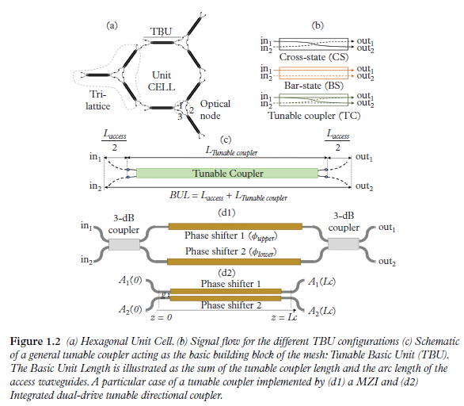

# Integrated Multi-port Interferometers and Waveguide Meshes 

## 1. Basic Concepts
Integrated multi-port interferometers and waveguide meshes are $2 \mathrm{D}$ structures where a unitary cell composed of a single tunable basic unit (TBU) (in the first case) or a subset of TBUs (in the second) is spatially replicated. 
Several examples are shown in the following Figure. 

Each unitary cell is implemented by one or more sets of integrated waveguide pairs
coupled by means of a TBU. Chapter 2 shows how its core can be a balanced MZI
or a directional coupler among other possible options. The application of external
electrical signals to the TBU allows the independent amplitude and phase control of
the photonic signals coupled between the two waveguides. In particular, each TBU
in the mesh can be configured to operate either as an optical crossbar switch or as
an intermediate power divider. In this way, the combination of different TBUs in the
2D grid—each individually configured as desired—enables the synthesis of any kind
of optical core circuit topology, including finite (FIR) and infinite impulse response
(IIR) multi-port interferometers and filters. 

每个单元由一组或多组通过 TBU 耦合的集成波导对实现。第 2 章介绍了其核心可以是平衡 MZI 或定向耦合器，以及其他可能的选项。
将外部电信号应用于 TBU，可以对耦合在两个波导之间的光子信号进行独立的振幅和相位控制。特别是，网状结构中的每个 TBU 都可配置为光交叉条开关或中间功率分配器。
这样，二维网格中不同 TBU 的组合--每个 TBU 都可根据需要单独配置--就能合成任何类型的光核心电路拓扑，包括有限（FIR）和无限脉冲响应（IIR）多端口干涉仪和滤波器。

Figure 1.1(a) and Figure 1.1(b) correspond
to meshes representing multi-port interferometers that will be addressed in Chapter 4.
Figure 1.1(a) shows the triangular interferometer proposed by Reck and colleagues 
[(M. Reck, et al.](https://journals.aps.org/prl/abstract/10.1103/PhysRevLett.73.58)
and Figure 1.1(b) the rectangular interferometer proposed by Clements and colleagues
[W. R. Clements, et al.](https://arxiv.org/abs/1603.08788). These have been widely employed in the implementation of quantum circuits: 
[A. Peruzzo, et al.](https://www.nature.com/articles/ncomms1228), 
[B.J. Metcalf, et al.](https://www.nature.com/articles/ncomms2349), 
[D.A.B. Miller](https://ee.stanford.edu/~dabm/429.pdf), 
[D.A.B. Miller](https://www-ee.stanford.edu/~dabm/430.pdf),
[J. Carolan, et al.](https://www.science.org/doi/10.1126/science.aab3642), 
[D.A.B. Miller, et al.](https://ee-www.stanford.edu/~dabm/445.pdf),
[N.C. Harris, et al.)](https://www.nature.com/articles/nphoton.2017.95). 

Note that they allow only feedforward propagation of light so they are limited to
the implementation of FIR multi-port interferometer filters. Figures 1.1(c)–1.1(e) show
the main reported designs for waveguide meshes allowing for both feedforward and
feedbackward propagation. Here the unit cell is composed by several TBUs following
a geometrical configuration: square, hexagonal and triangular, respectively. These are
the most flexible waveguide mesh configurations allowing the implementation of both
FIR and IIR multi-port interferometers and filters. Although each mesh topology has
inherent advantages, Chapter 4 and 5 shows how the hexagonal mesh is potentially the
most flexible approach for implementing the PIP concept.

图 1.1(a)和图 1.1(b)对应的网格代表第 4 章将讨论的多端口干涉仪。
图 1.1(a)是 Reck 及其同事提出的三角形干涉仪，
图 1.1(b)是 Clements 及其同事提出的矩形干涉仪。
这些干涉仪已被广泛应用于量子电路的实现。
请注意，它们只允许光的前馈传播，因此仅限于实现 FIR 多端口干涉仪滤波器。
图 1.1(c)-1.1(e)显示了已报道的允许前馈和后馈传播的波导网格的主要设计。这里的单元格由多个 TBU 组成，其几何结构分别为正方形、六角形和三角形。
这些都是最灵活的波导网格配置，可以实现 FIR 和 IIR 多端口干涉仪和滤波器。虽然每种网状拓扑结构都有其固有的优势，但六边形网状结构是实现 PIP 概念最灵活的方法; 这一点会在后面作详细解释。

## 2. Tunable Basic Units
The basic building block in the waveguide mesh is the TBU 
([D.A.B. Miller](https://www-ee.stanford.edu/~dabm/430.pdf), [L. Zhuang, et al.](https://opg.optica.org/optica/abstract.cfm?uri=optica-2-10-%20%20854), 
[D. Pérez, et al.](https://opg.optica.org/oe/fulltext.cfm?uri=oe-24-11-12093&id=341002), 
[M. Reck, et al.](https://journals.aps.org/prl/abstract/10.1103/PhysRevLett.73.58), 
[W. R. Clements, et al.)](https://spiral.imperial.ac.uk/bitstream/10044/1/57682/5/optica-3-12-1460.pdf)
Figure 1.2 (a) shows an example of a hexagonal cell implemented by nine TBUs arranged in three trilattice structures. 
Each TBU can be programmed to operate in one of the three modes shown in Figure 1.2(b). 
The central element of the TBU shown in Figure 1.2(c) is a $2 \times 2$ waveguide coupling element or tunable coupler, 
which can be implemented using different photonic components, 
including a balanced MZI (Figure 1.2(d1)) or a dual drive directional coupler (Figure 1.2(d2) [D. Pérez, et al.](https://opg.optica.org/jlt/abstract.cfm?uri=jlt-36-19-4591)), among other alternatives.

波导网格的基本构件是 TBU。
图 1.2 (a) 展示了一个六边形单元的示例，该单元由九个 TBU 组成，并以三个三晶格结构排列。
每个 TBU 都可以编程为以图 1.2(b) 所示的三种模式之一运行。
图 1.2(c) 所示 TBU 的中心元件是一个 2 x 2 的波导耦合元件或可调耦合器、 
它可以使用不同的光子元件来实现、 
包括平衡 MZI（图 1.2(d1)）或双驱动定向耦合器（图 1.2(d2)）等。

### 2.1. TBU Programming
TBUs based on $2 \times 2$ coupling elements in general and on MZI and dual drive directional couplers in particular can be programmed to achieve independent amplitude and phase shift settings. 
Here we illustrate the process for the MZI approach, but the reader will find detailed information regarding the dual drive directional coupler approach in Chapter 2. 
Referring to Figure 1.2(d1), the TBU can be programmed to implement three different states: cross state switch (light path connects $i n_1$ to out 2 and $i n_2$ to splitter. 
For example, a balanced MZI loaded with heaters on both arms has a splitting ratio obtained by increasing the effective index due to the Joule effect in the upper or lower arm, which produce a $\varphi_{\text {upper }}$ and $\varphi_{\text {lower }}$ phase shift, respectively. 
Once set, a common drive in both heaters will provide a common phase shift, 
leading to independent control of the amplitude ratio and the common phase. 
The device matrix is defined in Chapter 2, by [D.A.B. Miller](https://www-ee.stanford.edu/~dabm/430.pdf), 
[M. Reck, et al.](https://journals.aps.org/prl/abstract/10.1103/PhysRevLett.73.58), 
[D. Pérez, et al.](https://onlinelibrary.wiley.com/doi/full/10.1002/lpor.201700219):

一般来说，基于 $2 \times 2$ 耦合元件的 TBU，特别是基于 MZI 和双驱动定向耦合器的 TBU，可以通过编程实现独立的振幅和相移设置。
这里我们将说明 MZI 方法的过程，但读者可以在第 2 章中找到有关双驱动定向耦合器方法的详细信息。
参考图 1.2(d1)，TBU 可以通过编程实现三种不同的状态：交叉状态开关（光路将 $i n_1$ 连接到输出 2，将 $i n_2$ 连接到分光器。
例如，在两个臂上都装有加热器的平衡 MZI，其分光比是通过增加上臂或下臂的焦耳效应所产生的有效指数来获得的，这分别会产生 $\varphi_{\text {upper }}$ 和 $\varphi_{\text {lower }}$ 的相移。
一旦设定，两个加热器中的共同驱动将提供共同的相移，从而实现对振幅比和共同相位的独立控制。器件矩阵的定义见第 2 章：

$$
h_{T B U}=j e^{j \Delta}\left(\begin{array}{cc}
\sin \theta & \cos \theta \\
\cos \theta & -\sin \theta
\end{array}\right) \gamma
$$

where, $\theta$ is $\left(\varphi_{\text {upper }}-\varphi_{\text {lower }}\right) / 2$ and $\Delta$ is $\left(\varphi_{\text {upper }}+\varphi_{\text {lower }}\right) / 2$. 
The optical power coupling factor $K$ is then defined as $\cos ^2(\theta)$. 
Finally, $\gamma$ is a general loss term that includes the propagation and insertion losses of the access and tunable coupler waveguides and the $3-\mathrm{dB}$ couplers, respectively. 
For practical applications and in the case of MZI-based TBUs a more detailed description of the TBU operation is desired-one that takes into account the departure from the ideal $3-\mathrm{dB}$ splitting ratio of the input and output
couplers in the MZI, and the uneven insertion losses in each of its arms. 
This matrix representation has been derived by Mower and colleagues [(J. Mower, et al.)](https://dspace.mit.edu/bitstream/handle/1721.1/98899/PhysRevA.92.032322.pdf?sequence=1) and then applied in conjunction with random phase statistical representations of $\theta$ and $\Delta$ to analyse the impact of imperfect TBUs over the fidelity of several quantum gate circuits and the impact that their reconfigurability brings in improving this figure of merit, 
and Chapter 6 provides more detail. It also considers how TBU reconfigurability brings the additional potential for correcting fabrication errors and reports demonstrations over classical circuit configurations 
[(D.A.B. Miller](https://ee-www.stanford.edu/~dabm/445.pdf), 
[D. Pérez, et al.)](https://www.nature.com/articles/s41467-017-00714-1)

其中，$\theta$ 是 $\left(\varphi_{\text {upper }}-\varphi_{\text {lower }}\right) / 2$，
$\Delta$ 是 $\left(\varphi_{\text {upper }}+\varphi_{\text {lower }}\right) / 2$。
光功率耦合系数 $K$ 的定义为 $\cos ^2(\theta)$。
最后，$\gamma$ 是一个通用损耗项，分别包括接入波导和可调谐耦合器波导以及 $3-\mathrm{dB}$ 耦合器的传播损耗和插入损耗。
对于实际应用和基于 MZI 的 TBU，需要对 TBU 的运行进行更详细的描述，其中要考虑到 MZI 中输入和输出耦合器的理想 $3-\mathrm{dB}$ 分离比的偏离，
以及每个臂的不均匀插入损耗。Mower及其同事推导出了这种矩阵表示法，然后将其与$\theta$和$\Delta$的随机相位统计表示法结合使用，
分析了不完善的TBU对若干量子门电路保真度的影响，以及它们的可重构性对提高这一性能指标的影响，第6章提供了更多细节。
它还考虑了 TBU 的可重构性如何为纠正制造误差带来额外的潜力，并报告了经典电路配置的演示。
