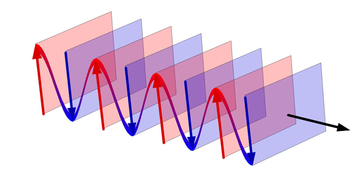

# 电磁场基础

以下内容来源于KAUST, ECE学院的Andrea Fratalocchi教授的课堂笔记。

## 光在各向同性 (isotropic) 且均质 (homogeneous) 的介质中与物质的相互作用
想象一下，一束光照射到了某种物质的表面。根据量子力学我们知道，物质是由原子组成的，而且原子的外层是特定结构的电子云。
光波是一种电磁波，因此它会和电子云发生相互作用。相互作用通过麦克斯韦方程组来描述：

$$
\left\{\begin{array}{l}
\nabla \times \vec{e}=-\partial_t \vec{b} \\
\nabla \times \vec{h}=\vec{j}+\partial_t \vec{d} \\
\nabla \cdot \vec{d}=\rho \\
\nabla \cdot \vec{b}=0
\end{array}\right.
$$

其中, $\vec{e}$, $\vec{h}$ 是电场/磁场强度, 用来描述电磁场 (光波); 

$\vec{d}$, $\vec{b}$ 代表着电位移 (electric displacement, 又称电感应强度)/磁感应强度, 
用来描述物质对电磁场的响应 (material response); 

$\vec{j}$, $\rho$ 代表电流密度/电荷密度，用来描述除了电磁波外的其他电磁源 (EM sourses).

### 材料对电磁场的响应

#### 前导知识：
**各向同性 (isotropic)**: 各向同性是指材料、系统或现象在所有方向上都表现出均匀性或一致性的一种属性或特征。

**均质 (homogeneous)**: 来描述在整个系统、物质或结构中成分或特性统一或一致的系统、物质或结构。这意味着系统内的属性或成分没有变化或差异，所有部分都是一样的。

例如, 一块染色的玻璃, 它是各向同性的, 但非均质.

**构成关系 (constitutive relations)**: 描述材料或物质的物理特性或行为与各种外部因素或条件之间关系的数学方程或关系。这些关系有助于建立材料响应与外加载荷、温度、应变或其他相关变量之间的联系。
在电磁学中，构成关系描述了材料的电特性和磁特性（如介电常数和磁导率）如何与电场和磁场的存在相关联。这些关系有助于确定材料如何与电磁波相互作用。

电磁学中的构成关系为: 

$$
\left\{\begin{array}{l}
\vec{b}=\mu_0 \vec{h} \\
\vec{d}=\varepsilon_0 \varepsilon_r \vec{e}=\varepsilon_0 n^2 \vec{e}=\varepsilon_0\left(1+\chi_0\right) \vec{e}
\end{array}\right.
$$

电位移的表达式中从三个方面描述了与电场强度的关系. 式一是从电磁学的角度 (相对介电常数), 式二是光学角度 (折射率), 式三是化学角度 (极化率). 本质相同, 只是按照不同学科的习惯和认知角度. 

当介质是各向且均质的时候，相对应的介电常数是一个标量 (scaler/constant), 当其各向异性时, 介电常数是一个张量 (tensor), 即光在不同方向传播时的折射率不同. 

材料对电磁场的响应可以用下图描述: 

### 电磁场的功

#### 前导知识:

**坡印廷定理 (Poynting Theorem)**: 

**Nabla算符 $\nabla$ 的运算律以及常用公式**: 

参考: https://zhuanlan.zhihu.com/p/52834609

Nabla 算符被定义为: 

$$
\nabla=\left(\frac{\partial}{\partial x}, \frac{\partial}{\partial y}, \frac{\partial}{\partial z}\right)=\vec{e}_x \frac{\partial}{\partial x}+\vec{e}_y \frac{\partial}{\partial y}+\vec{e}_z \frac{\partial}{\partial z}=\sum_{i=1}^3 \vec{e}_i \frac{\partial}{\partial x_i}
$$

极/柱坐标表达形式:
$\nabla=\vec{e}_r \frac{\partial}{\partial r}+\vec{e}_{\varphi} \frac{1}{r} \frac{\partial}{\partial \varphi}+\vec{e}_z \frac{\partial}{\partial z}$

运算律简记: 根据前面提到的具有的微分运算性质与具有矢量形式的性质可以将它的运算拆分为两部分:

- 微分运算, 即按照乘积的微分(导数)公式: $\frac{\mathrm{d}}{\mathrm{d} x}(f g)=\frac{\mathrm{d} f}{\mathrm{~d} x} g+f \frac{\mathrm{d} g}{\mathrm{~d} x}$ 变形.
- 变形之后只要当作矢量去化简就好了, 相当于已经考虑完了微分的性质.

*化简就是想办法利用标量矢量混合运算让 $\nabla$ 作用在该作用的地方.*

* 例如:

$$
\nabla(\varphi \psi)=\nabla\left(\varphi \psi_c\right)+\nabla\left(\varphi_c \psi\right)=\psi \nabla \varphi+\varphi \nabla \psi
$$

中间部分就是微分的作用, 下标 c 的意思是 $\nabla$ 不作用于它, 当它是常数. 

* 再例如: 

$$
\nabla \cdot(\varphi \vec{f})=\nabla \cdot\left(\varphi \vec{f}_c\right)+\nabla \cdot\left(\varphi_c \vec{f}\right)=\nabla \varphi \cdot \vec{f}+\varphi \nabla \cdot \vec{f}
$$

$$
\nabla \times(\varphi \vec{f})=\nabla \times\left(\varphi \vec{f}_c\right)+\nabla \times\left(\varphi_c \vec{f}\right)=\nabla \varphi \times \vec{f}+\varphi \nabla \times \vec{f}
$$

第一步, 先让 $\nabla$ 分别作用; 第二步, $\nabla$ 与 $\vec{f}$ 是矢量, $\varphi$ 是标量, 按照传统的运算手段整理它们即可. 

* 接下来的例子会真正地用到矢量运算: 

$$
\nabla \cdot(\vec{f} \times \vec{g})=\nabla \cdot\left(\vec{f} \times \vec{g}_c\right)+\nabla \cdot\left(\vec{f}_c \times \vec{g}\right)=(\nabla \times \vec{f}) \cdot \vec{g}-(\nabla \times \vec{g}) \cdot \vec{f}
$$

关注第二步, 这就是前面提到的想办法利用标量矢量混合运算让 $\nabla$ 作用在该作用的地方. 大家都是矢量, 那就要按照矢量的规则来, 这是混合积, 具有轮换对称性 (行列式那个交换行列的性质). 

可别写出这种东西来: $\vec{f}_c \cdot(\vec{g} \times \nabla)$, 此时算符它作用在半个括号上了. 算符都是向右作用的! 

* 下一例: 

$$
\begin{aligned}
\nabla \times(\vec{f} \times \vec{g}) & =\nabla \times\left(\vec{f} \times \vec{g}_c\right)+\nabla \times\left(\vec{f}_c \times \vec{g}\right) \\
& =(\vec{g} \cdot \nabla) \vec{f}-(\nabla \cdot \vec{f}) \vec{g}+(\nabla \cdot \vec{g}) \vec{f}-(\vec{f} \cdot \nabla) \vec{g}
\end{aligned}
$$

* 下一例较为复杂: 

$$
\nabla(\vec{f} \cdot \vec{g})=\vec{f} \times(\nabla \times \vec{g})+(\vec{f} \cdot \nabla) \vec{g}+\vec{g} \times(\nabla \times \vec{f})+(\vec{g} \cdot \nabla) \vec{f}
$$

用到的公式是: $\vec{C}(\vec{A} \cdot \vec{B})=(\vec{A} \cdot \vec{C}) \vec{B}-\vec{A} \times(\vec{B} \times \vec{C})$. 

考虑到微分运算特性, 可以得到: $\nabla(\vec{f} \cdot \vec{g})=\nabla\left(\vec{f} \cdot \vec{g}_c\right)+\nabla\left(\vec{f}_c \cdot \vec{g}\right)$

接下来套用矢量运算式, 对于 $\nabla\left(\vec{f} \cdot \vec{g}_c\right)$, 我们希望可以得到 $\nabla \times \vec{f}$ 或 $\vec{f} \times \nabla$, 

观察式子 $\nabla$ 在括号外即 $\nabla=\vec{C}$ 那么就要令 $\vec{f}=\vec{B}$, 自然 $\vec{g}=\vec{A}$. 

这样一来可以得到: $\nabla\left(\vec{f} \cdot \vec{g}_c\right)=\left(\vec{g}_c \cdot \nabla\right) \vec{f}-\vec{g}_c \times(\vec{f} \times \nabla)$. 

后面一项希望得到的是 $\nabla \times \vec{g}$ 或 $\vec{f} \times \nabla$, 处理方法类似. 

最终可以得到: 

$$
\begin{aligned}
\nabla(\vec{f} \cdot \vec{g}) & =\nabla\left(\vec{f} \cdot \vec{g}_c\right)+\nabla\left(\vec{f}_c \cdot \vec{g}\right) \\
& =\left[\left(\vec{g}_c \cdot \nabla\right) \vec{f}-\vec{g}_c \times(\vec{f} \times \nabla)\right]+\left[\left(\vec{f}_c \cdot \nabla\right) \vec{g}-\vec{f}_c \times(\vec{g} \times \nabla)\right] \\
& =(\vec{g} \cdot \nabla) \vec{f}+\vec{g} \times(\nabla \times \vec{f})+(\vec{f} \cdot \nabla) \vec{g}+\vec{f} \times(\nabla \times \vec{g}) .
\end{aligned}
$$

让我们回到上一节中提到的电子云和电磁场发生相互作用的环节. 电子云发生偏移的过程中伴随着做功。

电磁场在单位空间, 单位时间内做功为 $\vec{j} \cdot \vec{e}$

基于麦克斯韦方程组: 

$$
\left\{\begin{array}{l}
\nabla \times \vec{e}=-\partial_t \vec{b} \\
\nabla \times \vec{h}=\vec{j}+\partial_t \vec{d}
\end{array}\right.
$$

可以得到: 

$$
\left\{\begin{array}{l}
\nabla \times \vec{h}-\partial_t \vec{d}=\vec{j} \\
\vec{e} \cdot\left(\nabla \times \vec{h}-\partial_t \vec{d}\right)=\vec{e} \cdot \vec{j}
\end{array}\right.
$$

通过向量运算法则, $\nabla \cdot(\vec{e} \times \vec{h})=\vec{h}(\nabla \times \vec{e})-\vec{e}(\nabla \times \vec{h})$, 

得到坡印廷定理: $\nabla \cdot(\vec{e} \times \vec{h})+\vec{h} \partial_t \vec{b}+\vec{e} \partial_t \vec{d}=-\vec{j} \cdot \vec{e}$

我们定义 $\vec{s}=\vec{e} \times \vec{h}$ 为电磁场的能量通量 (energy flux, 又译作能流). 量纲为每单位面积的功率密度. 

再定义 $U=\frac{1}{2}(\mathbf{h} \cdot \mathbf{b}+\mathbf{e} \cdot \mathbf{d})$ 为电磁场的能量密度, 量纲是每单位体积的能量. 

这样我们就得到了电磁场的能量守恒方程: $\partial_t U+\nabla \cdot \vec{s}=-\vec{j} \cdot \vec{e}$. 

结合光入射介质的场景，我们可以得到下面的示意图: 

其中 $\partial_t U$ 表示材料内部可获取的能量, $\nabla \cdot \vec{s}$ 是能量通量，例如从材料所有边界进入材料的光子. 

#### 思考: 为什么能量是基础量？ 

因为能量与模长 (norm) 的概念相关，这一点和 "长度" 这一基本概念相关. 这是一个普适的结果, 例如: 

电路中功率: $P=v \cdot i \sim|i|^2$

弹性系统 (例如弹簧) 的能量: $H \sim \frac{1}{2} k \cdot|\vec{x}|^2$

#### 思考: 还有什么类似的表达式？

与 $\partial_t U+\nabla \cdot \vec{s}=-\vec{j} \cdot \vec{e}$ 类似, 

自由电子的薛定谔方程: $i \hbar \partial_t \psi+\frac{\hbar^2}{2 m} \nabla^2 \psi=0$. 

因为 $A = B$, 那么 $|A| = |B|$, 得到: 
$\begin{aligned} & \partial_t|\psi|^2=i \frac{\hbar}{2 m} \nabla \cdot\left[\psi^* \nabla \psi-\psi \nabla \psi^*\right] \\ & \partial_t \int_{-\infty}^{+\infty} d v|\psi|^2=i \frac{\hbar}{2 m} \int_{-\infty}^{+\infty} d v \nabla \cdot \vec{J}=0 \\ & \end{aligned}$ 

得到总的粒子数守恒: $\int_{-\infty}^{+\infty} d v|\psi|^2= const$. 

### 波函数的复数形式
$$
a(t)=|A| \cdot \cos (\omega t+\varphi)=\mathbb{R}\left\{|A| e^{j w t+\varphi}\right\}=\frac{1}{2}|A| e^{j \varphi} e^{j w t}+c . c.
$$ 

* c.c. 指的是前一部分的共轭复数/函数.

复数函数的时间平均值: 

$$
\begin{aligned}
\langle a(t) \cdot b(t)\rangle & =\frac{1}{\Delta} \int_0^{\Delta}|A \cdot B| \cos (w t+\alpha) \cdot \cos (w t+\beta) d t= \\
& =\left\langle\frac{1}{4}\left(A \cdot B e^{j 2 w t}+A^* \cdot B+\text { c.c. }\right)\left\rangle=\frac{1}{2}\right\langle \frac{A^* B}{2}+\text { c.c. }\right\rangle
\end{aligned}
$$

$$
\langle a(t) \cdot b(t)\rangle=\frac{1}{2} R e\left\{A^* B\right\}
$$

推导过程: 

$$
\begin{aligned}
\langle a(t) \cdot b(t)\rangle & =\frac{1}{\Delta} \int_0^{\Delta}|A \cdot B| \cos (\omega t+\alpha) \cdot \cos (\omega t+\beta) d t \\
& \left.=\frac{1}{\Delta} \int_0^{\Delta} \frac{1}{2} A e^{j \omega t}+\frac{1}{2} A^* e^{-j \omega t}\right)\left(\frac{1}{2} B e^{j \omega t}+\frac{1}{2} B^* e^{-j \omega t}\right) \\
& =\frac{1}{\Delta} \int_0^{\Delta}\left(\frac{\frac{1}{4}}{4} A \cdot B e^{j 2 \omega t}+\frac{1}{4} A \cdot B^*+\frac{1}{4} A^* B+\frac{1}{4} A^* B^* e^{-j 2 \omega t}\right) d t \\
& =\frac{1}{\Delta} \int_0^{\Delta} \frac{1}{2} \operatorname{Re}\left\{A^* B\right\}+\frac{1}{2} \operatorname{Re}\left\{A \cdot B e^{j 2 \omega t}\right\} d t \\
& Note: A B \cos (2 \omega t) \text { time avevage }=0 \\
& =\left\langle\frac{1}{2} \operatorname{Re}\left\{A^* B\right\}\right\rangle
\end{aligned}
$$

### 光场强度 (Optical Intensity)
量纲: 平均功率 (W) x 单位面积由电磁场携带的沿传播方向的能量(unit area carried by the EM field in the direction of propagation of the energy) (/$m^2$)

意义: 
是实际可以被测量的物理量. 例如: 测量激光的功率, 实际上测的是激光谐振腔 (cavity) 的损耗的时间平均值 (更多的能量被包含在腔内).   

active sources: can be measured. reactive sources: can't be measured. 

### 平面波

平面谐波 (harmonic plane wave) 是指单一频率的，且波前 (wavefront, surface of constant phase) 为无限大的平行平面; 这些平面 (位于?) 振幅为常数的峰值处且垂直于相位速度 (的矢量).
(A harmonic plane wave is a constant-frequency wave whose wavefronts (surface of constant phase) are infinite parallel planes of constant peak-to-peak amplitude normal to the plane velocity vector)

* 平面波的表达式: 

$$
\left\{\begin{array}{l}
\vec{e}=\frac{1}{2} \vec{E} e^{i(\omega t-\vec{k} \cdot \vec{r})}+c c . \\
\vec{h}=\frac{1}{2} \vec{H} e^{i(\omega t-\vec{k} \cdot \vec{r})}+c c . \\
\vec{r}=[x,y,z]
\end{array}\right.
$$

我们对平面波如此感兴趣的原因是因为平面波的求导运算可以转换成乘法运算: 

$$
\left\{\begin{array}{l}
\nabla \rightarrow-i \vec{k} \\
\partial_t \rightarrow i \omega
\end{array}\right.
$$

其中 $\nabla$ 是矢量, 即: 

$$
\left\{\begin{array}{l}
\nabla \cdot \rightarrow-i \vec{k} \cdot \\
\nabla \times \rightarrow-i \vec{k} \times
\end{array}\right.
$$

#### 色散关系
将平面波表达式代入麦克斯韦方程组, 可得: 

$$
\begin{aligned}
& \nabla \times \nabla \times \vec{e}=-u_0 \partial_t(\nabla \times \vec{h}) \\
& =-{u_0 \varepsilon_0} n^2 \partial_t^2 \vec{e}=\left(\frac{n}{c_0}\right)^2 \partial_t^2 \vec{e} \\
& {\nabla \times \nabla} \times \vec{e}= \nabla^2 \vec{e} -\nabla(\nabla \cdot \vec{e}) \\
& \because \nabla \cdot \vec{e}=0,  \therefore \nabla^2 \vec{e}=\left(\frac{n^2}{c_0^2}\right) \partial_t^2 \vec{e} \\
& \because \text { plane wave, } \therefore k^2 \vec{e}=\frac{n^2}{c} w^2 \vec{e} 
\end{aligned}
$$

$\omega^2=\frac{c_0^2 k^2}{\varepsilon_r}$ 被称为 **色散关系** (dispersion relation). 注意这个式子只在各向同性 (isotropic) 且均质 (homogenous) 的材料中才成立. 

#### 真空阻抗 

根据麦克斯韦方程组: 

$$
\left\{\begin{array}{l}
\nabla \times \vec{e}=-\mu_0 \partial_t \vec{h} \\
\nabla \times \vec{h}=\varepsilon_0 n^2 \partial_t \vec{e}
\end{array}\right.
$$

得到: 

$$
-i \vec{k} \times \vec{E}=-i \mu_0 \omega \vec{H}
$$

代入色散关系可以得到: 

$$
\vec{H}=\frac{n}{\eta_0} \hat{k} \times \vec{E}
$$

我们将 $\eta_0=\sqrt{\frac{\mu_0}{\varepsilon_0}}$ 定义为真空阻抗 (vacuum impedance). 它的值大约是120*

练习: 说明平面波的单位矢量 $\vec{k}$, $\vec{E}$, $\vec{H}$ 互相垂直. 

$$
\vec{H}=\frac{n}{n_0} \vec{k} \times \vec{E} \text { is orthogonal to } \vec{\mathrm{k}} \text { and } \vec{\mathrm{E}}
$$

$$
\because \nabla \cdot \vec{e}=\nabla \cdot \vec{h}=0 \therefore \vec{k} \cdot \vec{E}=\vec{k} \cdot \vec{H}=0
$$

上式使用了平面波的求导性质. 

练习: 计算坡印廷矢量的方向和模长. 

$$
\begin{aligned}
& \vec{s}=\vec{e} \times \vec{h}=s \cdot \vec{k} \\
& \langle s\rangle=\frac{1}{2} R e\left\{E^* \cdot H\right\}=\frac{1}{2}|E|^2 \frac{n}{\eta_0}
\end{aligned}
$$

