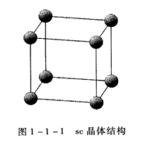
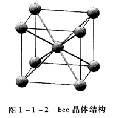
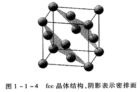

# 晶体的结构及其对称性

## 前言：什么是晶体？
凝聚态物质包括液体、固体以及介于其间的软物质（如液晶、凝胶等），它们是原子、离子 
或分子的聚集体。

固体是凝聚态物质中的一种特殊聚集形态。在压强和温度一定，且无外力作用时，形状不变。液体则没有这种性质。根据组成粒子在空间排列的有序度和对称性，
固体可以分为晶体、准晶体和非晶体三类。

晶态固体的组成粒子在空间周期性排列，具有长程序。由于周期性的限制，
它不能保持对任意的平移和旋转不变，其对称性是破缺的。

与晶态固体相反,非晶态固体的组成粒子在空间的分布是完全无序或仅仅具有短程序。若不考虑可能存在的短程序，根据物性测量的判断，
在统计意义上，无序固体中粒子的分布与气体和液体相似，具有高度的对称性，物理性质各向同性。

准晶体介于晶体和非晶体之间。虽然粒子的分布是完全有序的，但不具有周期性，
仅仅具有长程取向序，可以具有晶体所不允许的旋转对称性。

固体物理把晶态物质作为主要讨论对象，基本的出发点在于强调周期性，
考虑破缺的对称性。偏离周期性的问题，仅仅作为固体物理学基本理论的向外延拓。

## 1.1 晶格及其平移对称性
### 1.1.1 晶体结构
以下4种
(1) 简单立方(sc)晶体结构

堆积密度f = $\pi$/6

(2) 体心立方(bcc)晶体结构

堆积密度f = $\sqrt{3}$*$\pi$/8

(3) 面心立方(fcc)晶体结构

堆积密度f = $\sqrt{2}$*$\pi$/6

